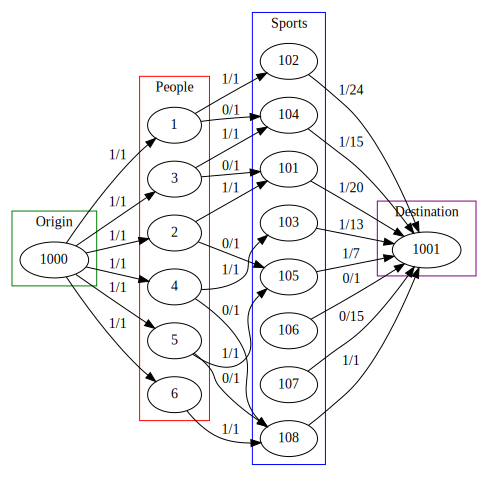

OCAML project of :  
- LACAU Clément  
- Loubejac Jean-Philippe.  
This project implements a sport attribution that could be used in attributing sports to INSA Toulouse's students.

## Building
```bash
make clean
make build
```
## Running
```bash
make demo
dot -Tsvg aps.dot > aps.svg
open aps.svg
```
## Medium project: Attribution des sports en APS
Bipartite matching.
Chaque noeud étudiant se voit attribuer un arc entre la source et l'étudiant de capacité 1
Chaque étudiant peut choisir autant de sports qu'il veut. Cela crée un arc entre l'étudiant et chaque sport.
Chaque sport a une capacité limité. Notre algo donne de manière aléatoire une répartition des étudiants dans les sports
en respectant obligatoirement leurs voeux.

### Example
Use `sportvoeux2.txt`
```bash
make clean
make build
make demo
dot -Tsvg aps.dot > aps.svg
open aps.svg
```



## Better project: Max flow, min cost
Les étudiants peuvent hiérarchiser leurs voeux. Cela sera pris en compte dans l'attribution de leurs voeux, via un graphe
avec un flow max et un coût minimal. La valeur accordée par un étudiant pour un voeu donne directement le coût de ce voeu.

## Help
A [`Makefile`](Makefile) provides some useful commands:

 - `make build` to compile. This creates an `ftest.exe` executable
 - `make demo` to run the `ftest` program with some arguments
 - `make format` to indent the entire project
 - `make edit` to open the project in VSCode
 - `make clean` to remove build artifacts

In case of trouble with the VSCode extension (e.g. the project does not build, there are strange mistakes), a common workaround is to (1) close vscode, (2) `make clean`, (3) `make build` and (4) reopen vscode (`make edit`).


