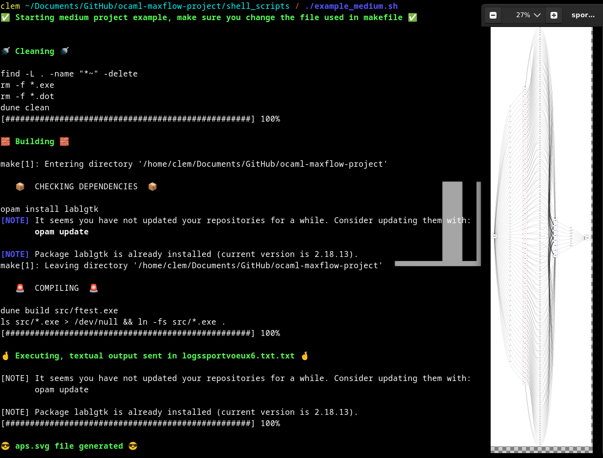
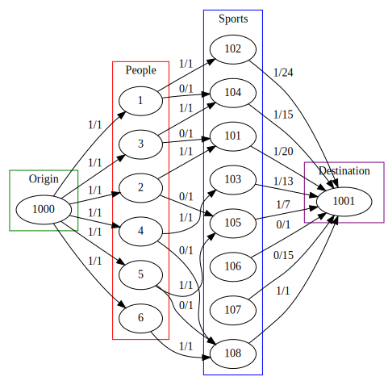
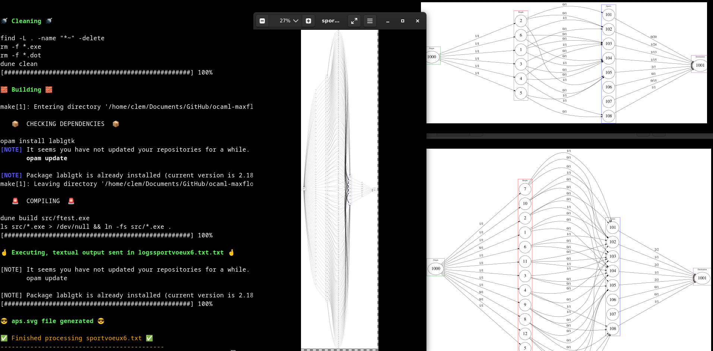
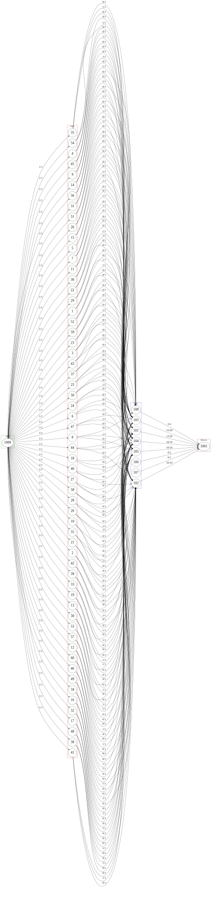
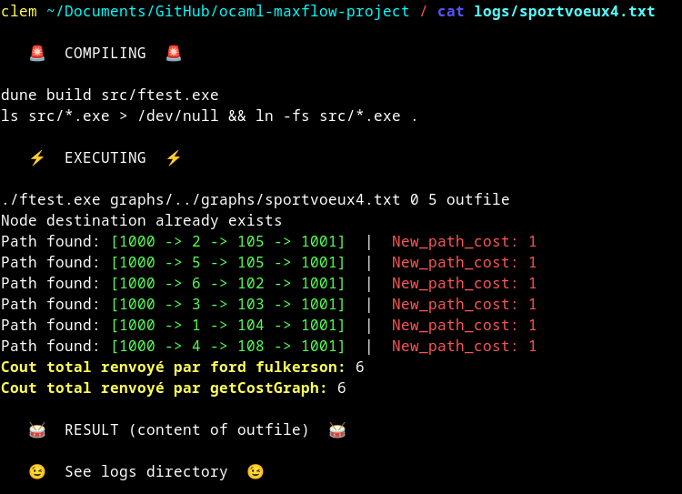
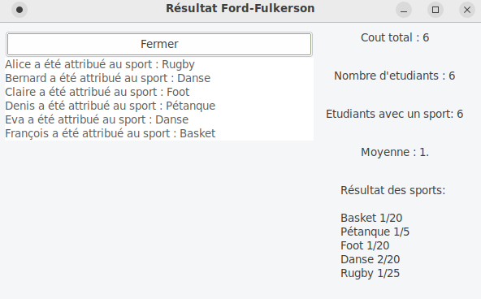

# OCAML project  
- LACAU Clément  
- Loubejac Jean-Philippe.  
This project implements a sport attribution that could be used in attributing  
sports to INSA Toulouse's students.

NOTE: ALL EXPECTED VERSIONS ARE FULLY FUNCTIONAL: minimal, medium and better project.  
We went further in the better project version, especially in the presentation  
of results into data that are human readable, with textual, graphs and graphical outputs.  

You can find several tags for different versions of the code:  
- [TAG_MEDIUM_PROJECT](https://github.com/Maskass57/ocaml-maxflow-project/releases/tag/medium_project)  
- [TAG_ADVANCED_PROJECT](https://github.com/Maskass57/ocaml-maxflow-project/releases/tag/advanced_version)  
- [TAG_NO_GUI](https://github.com/Maskass57/ocaml-maxflow-project/releases/tag/NoGUI)  
The actual version contains a GUI used to display the results obtained from running.  

## Building and running (not recommended, see below to use our scripts)
Note that we automated the installation of lablgtk (used to display results) via make build.
More importantly, all those steps are automated in some scripts : [Shell script](https://github.com/Maskass57/ocaml-maxflow-project?tab=readme-ov-file#automatic-testing)

```bash
make clean
make build
make demo
dot -Tsvg aps.dot > aps.svg
open aps.svg
```

## Medium project: Attribution des sports en APS
[TAG_MEDIUM_PROJECT](https://github.com/Maskass57/ocaml-maxflow-project/releases/tag/medium_project)
(In french to avoid miscomprehensions)  
Bipartite matching.
Chaque noeud étudiant se voit attribuer un arc entre la source et l'étudiant de capacité 1.  
Chaque étudiant peut choisir autant de sports qu'il veut. Cela crée un arc entre l'étudiant et chaque sport.  
Chaque sport a un arc avec une capacité limité jusqu'à la destination. Notre algo donne de manière aléatoire une  
répartition des étudiants dans les sports en respectant obligatoirement leurs voeux et en maximisant bien sur le flot.  

### Automatic testing
Those scripts allow to test in a developper and tester-friendly way.  
You may run the following commands:  
```bash
cd shell_scripts
./example_medium.sh
```
Output:


### Example

Use `sportvoeux2.txt`
```bash
make clean
make build
make demo
dot -Tsvg aps.dot > aps.svg
open aps.svg
```



## Better project: Max flow, min cost
[TAG_ADVANCED_PROJECT](https://github.com/Maskass57/ocaml-maxflow-project/releases/tag/advanced_version)  
(In french to avoid miscomprehensions)  
Les étudiants peuvent réaliser 3 voeux hiérarchisés. Chaque voeu est noté avec un indice 1,2 ou 3.  
Le voeu 1 est le voeu préféré de l'étudiant et le voeu 3 le moins attendu.   
Cela est pris en compte dans l'attribution de leurs voeux, via un graphe avec un flot max et un coût minimal.  
La valeur accordée par un étudiant pour un voeu donne directement le coût de ce voeu: 1,2,3.  
Notre implémentation retourne avec succès la répartition optimale des voeux, minimisant le coût total, et  
maximisant ainsi le bonheur des étudiants en permettant une attribution des voeux qui donne le plus de sports 
tout en maximisant les hiérarchies des sports données par les étudiants.  
Nous sommes allés plus loin et avons cherché à analyser et vérifier les sorties procurées par notre implémentation.  
Pour cela, nous avons des sorties textuelles, des graphes, et graphiques.
Nous vous invitons à les consulter ci-dessous: 

### Automatic testing
Those scripts allow to test in a developper and tester-friendly way. 
This script offers a very good way of testing as we can specify a list of files to test.  
In this case, we test the following files: [sportvoeux4.txt](./graphs/sportvoeux4.txt),[sportvoeux5.txt](./graphs/sportvoeux5.txt),[sportvoeux6.txt](./graphs/sportvoeux6.txt)  
Basically, this command only runs the previous script [](./shell_scripts/example_medium.sh) but several times.
You may run the following commands: 
```bash
cd shell_scripts
./advanced_demo.sh
```
You can access the textual outputs of the graphs generated (including the global cost and each path found in the logs dir)
With a single run, we get the following (and the GUI):


### Example
Dans ce graphe, nous avons 60 étudiants et 75 places au total, tous sports confondus.
La répartition génère un coût total de 71. 
Autrement dit, les étudiants obtiennent en moyenne leurs voeux numéro 1,18, soit une excellente répartition. 

Use `sportvoeux6.txt`
```bash
make clean
make build
make demo
dot -Tsvg aps.dot > aps.svg
open aps.svg
```


## To go further
As we want resolve a problem, we want to be able to see the results.
Note that those results are not correlated between them.

### Textual output
We have the logs files that provide the exact results available at ./logs.


### Graphical output
We have an instance of a gui generated whenever we run that:
- associates each person to the sport obtained
- shows the total cost of the result
- shows the number of students assigned to each sport and the maximal number that could have been assigned  


### Graph output
And finally, we have the graph generated using GraphViz:


## Help
A [`Makefile`](Makefile) provides some useful commands:
 - `install-deps` to install the required dependencies 
 - `make build` to compile. This creates an `ftest.exe` executable
 - `make demo` to run the `ftest` program with some arguments
 - `make format` to indent the entire project
 - `make edit` to open the project in VSCode
 - `make clean` to remove build artifacts

In case of trouble with the VSCode extension (e.g. the project does not build, there are strange mistakes), a common workaround is to (1) close vscode, (2) `make clean`, (3) `make build` and (4) reopen vscode (`make edit`).


